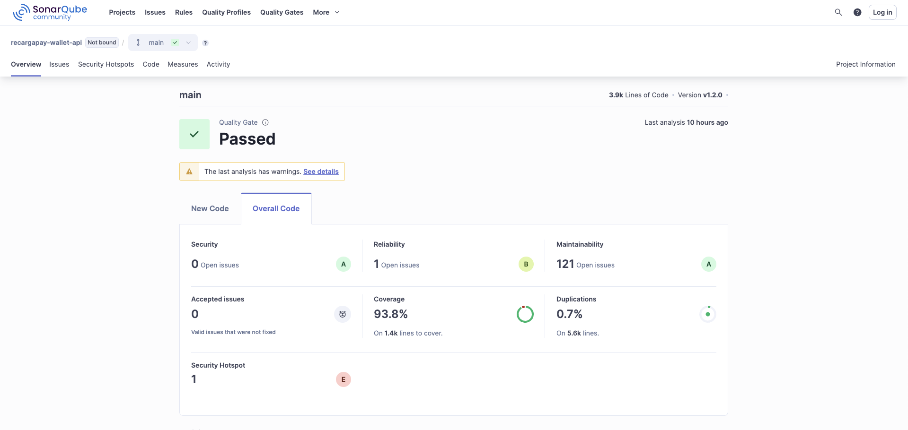
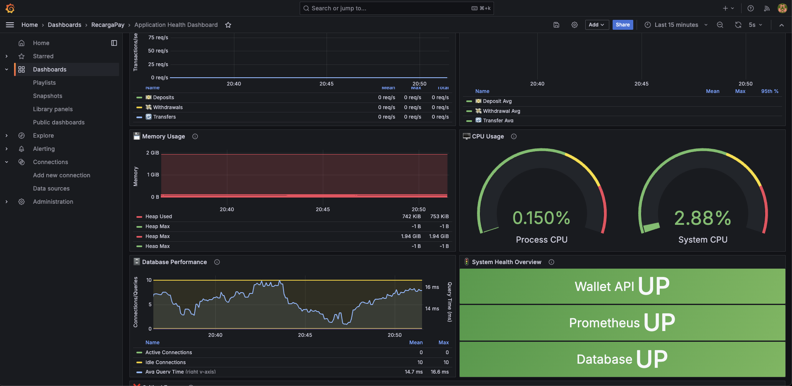
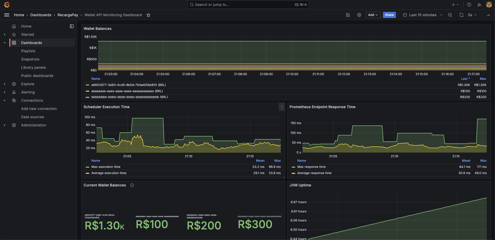
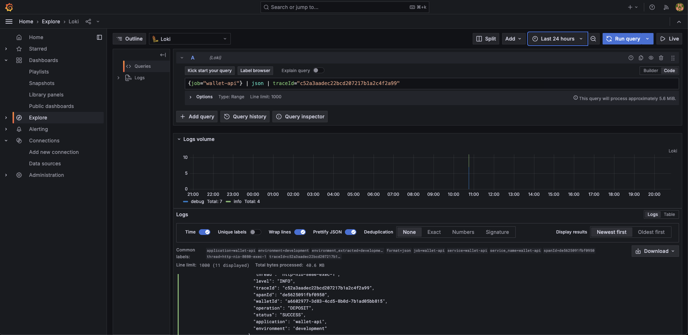
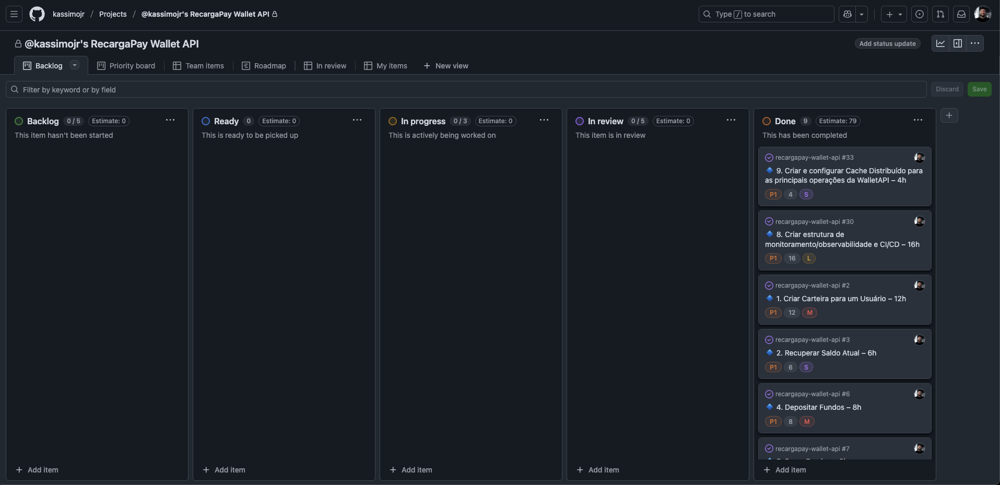

# 🚀 RecargaPay Wallet API

## 📌 Overview

The RecargaPay Wallet API is a robust digital wallet service that enables users to manage their financial balance, offering essential operations such as deposit, withdrawal, and fund transfers between users. Built with hexagonal architecture and software engineering best practices, this service ensures high availability, complete traceability, and security in all financial operations.

---

## 📑 Table of Contents

- [🎯 Objectives](#-objectives)
- [🏗️ Architecture](#️-architecture)
- [💻 Technologies](#-technologies)
- [🚀 Getting Started](#-getting-started)
- [🧪 Testing & Quality](#-testing--quality)
- [📝 API Reference](#-api-reference)
- [🛠️ Operations & Monitoring](#️-operations--monitoring)
- [🔒 Security](#-security)
- [📚 Complete Documentation](#-complete-documentation)
- [🌍 Language Versions](#-language-versions)

---

## 🎯 Objectives

This digital wallet service was developed to meet the following requirements:

### Functional Requirements

- **Wallet Creation**: Enable wallet creation for users
- **Balance Inquiry**: Retrieve current wallet balance for a user
- **Historical Balance**: Retrieve wallet balance at a specific point in time
- **Deposit**: Allow fund deposits to the wallet
- **Withdrawal**: Allow fund withdrawals from the wallet
- **Transfer**: Facilitate fund transfers between user wallets

### Non-Functional Requirements

- **High Availability**: Critical service whose unavailability would compromise the platform
- **Traceability**: Complete audit guarantee for all operations to verify balances
- **User Experience**: Detailed and informative responses, including user names
- **Error Handling**: RFC 7807 implementation for all known errors
- **Concurrency**: Isolated transactions to prevent race conditions

---

## 🏗️ Architecture

The project is implemented following **Hexagonal Architecture** (or Ports and Adapters) principles, which allows clear isolation between business rules and infrastructure details.

### Package Structure

```
com.recargapay.wallet/
├── adapter/                     # Adapters (Controllers, Repositories, DTOs)
│   ├── controllers/
│   │   └── v1/                  # REST Controllers v1
│   ├── converters/              # Layer converters (mappers)
│   ├── dtos/                    # Data Transfer Objects
│   ├── entities/                # JPA Entities
│   └── repositories/
│       └── impl/                # Repository implementations
├── core/                        # Business core
│   ├── domain/                  # Domain models
│   ├── exceptions/              # Business exceptions
│   ├── ports/                   # Ports (interfaces)
│   │   ├── in/                  # Input ports (use cases)
│   │   └── out/                 # Output ports (repositories)
│   └── services/                # Use case implementations
│       └── common/              # Common services
└── infra/                       # Infrastructure
    ├── config/                  # Configurations
    ├── handler/                 # Global exception handling
    ├── health/                  # Custom health indicators
    ├── logging/                 # Structured logging
    ├── metrics/                 # Metrics and monitoring
    └── tracing/                 # Distributed tracing
```

### Component Diagram

```
┌─────────────────────────────────────────────────────────────┐
│                  API Layer (Controllers)                     │
│              REST Endpoints + OpenAPI/Swagger                │
└───────────────────────────┬─────────────────────────────────┘
                            │
                            ▼
┌─────────────────────────────────────────────────────────────┐
│                    Application Layer                         │
│                 Services (Use Cases)                         │
│          Business Logic + Validation + Caching              │
└───────────────────────────┬─────────────────────────────────┘
                            │
                            ▼
┌─────────────────────────────────────────────────────────────┐
│                      Domain Layer                            │
│         Entities + Business Rules + Exceptions               │
│              (User, Wallet, Transaction)                     │
└───────────────────────────┬─────────────────────────────────┘
                            │
                            ▼
┌─────────────────────────────────────────────────────────────┐
│                   Infrastructure Layer                       │
│    Database + Cache + Security + Monitoring + Logging       │
│    PostgreSQL + Redis + JWT + Grafana + Structured Logs     │
└───────────────────────────┬─────────────────────────────────┘
                            │
                            ▼
┌─────────────────────────────────────────────────────────────┐
│                   Observability Stack                       │
│     Prometheus + Grafana + Loki + Tempo + OpenTelemetry     │
│          Real-time Dashboards + Alerts + Tracing            │
└─────────────────────────────────────────────────────────────┘
```

### Architecture Features

- **🔒 Security**: JWT authentication, CORS, security headers
- **📊 Monitoring**: Prometheus metrics, custom health checks
- **📝 Logging**: Structured JSON logging with distributed tracing
- **⚡ Caching**: Redis distributed cache with TTL strategies
- **🔍 Observability**: OpenTelemetry integration for tracing
- **🛡️ Resilience**: Global exception handling and validation

---

## 💻 Technologies

The project uses a modern and robust technology stack:

### Core Stack
- **Java 21** - Latest LTS version with modern language features
- **Spring Boot 3.2+** - Enterprise-grade framework with auto-configuration
- **PostgreSQL 16** - Robust relational database with advanced features
- **Redis 7** - High-performance distributed caching and session storage
- **Docker & Docker Compose** - Containerization with **pinned stable versions** (no `latest` tags)

### Security & Authentication
- **Spring Security 6** - Comprehensive security framework
- **JWT (JSON Web Tokens)** - Stateless authentication mechanism
- **BCrypt** - Secure password hashing algorithm
- **CORS Configuration** - Cross-origin resource sharing setup
- **Security Headers** - HTTP security headers (HSTS, X-Frame-Options, etc.)

### Observability Stack
- **Prometheus v2.45.6** - LTS version with proven stability in production
- **Grafana 11.2.0** - **Modern dashboards** with enhanced UI and business intelligence
- **Loki 3.1.1** - Stable structured JSON log aggregation with performance improvements
- **Promtail 3.1.1** - Enhanced log shipping with correlation IDs and compatibility
- **Tempo 2.4.2** - Stable distributed tracing with reliable capabilities
- **OpenTelemetry** - Unified observability framework with full stack integration

### Development & Quality
- **Maven** - Dependency management and build automation
- **SonarQube 25.7** - Code quality analysis and coverage reporting
- **JUnit 5** - Modern testing framework with extensive assertions
- **Testcontainers** - Integration testing with real database instances
- **Jacoco** - Code coverage analysis and reporting

> **📋 Note**: All Docker images use **pinned stable versions** instead of `latest` tags to ensure reproducible builds and prevent unexpected breaking changes. See [Docker Versions Guide](docs/configuration/en/docker-versions.md) for version selection criteria.

---

## 🚀 Getting Started

### Prerequisites

- JDK 21
- Maven 3.8+
- Docker and Docker Compose
- Git

### Cloning the Repository

```bash
git clone https://github.com/your-username/recargapay-wallet-api.git
cd recargapay-wallet-api
```

### 🎯 Quick Validation (Recommended)
**CI/CD Pipeline Simulation** - Complete validation in one command:

```bash
./wallet-api-startup.sh
```

This script simulates a complete CI/CD pipeline and validates:
- ✅ **Automatic `.env` generation** (from template with secure defaults)
- ✅ Environment setup and dependencies
- ✅ Infrastructure services startup (Docker Compose)
- ✅ Application build and tests (Maven)
- ✅ Code quality analysis (SonarQube)
- ✅ Application deployment and health checks
- ✅ **Monitoring stack validation** (Grafana dashboards)

**🎯 Perfect for**: Code reviews, integration validation, demo preparation

### 🛠️ Development Modes
For specific development needs:

#### Manual Infrastructure Setup
```bash
docker-compose up -d  # Infrastructure only
mvn spring-boot:run   # Application in development mode
```

#### Step-by-Step Validation
```bash
# 1. Infrastructure services
docker-compose up -d

# 2. Build & Test
mvn clean verify

# 3. Code Quality
mvn sonar:sonar

# 4. Application
mvn spring-boot:run
```

This will start:
- PostgreSQL database (port 5432)
- Redis cache (port 6379)
- **Enhanced observability stack** (Prometheus, Grafana, Loki, Tempo)
- SonarQube code analysis (port 9000)

### 🔧 Script Permissions (Troubleshooting)

If you encounter permission errors when running scripts, fix all script permissions:

```bash
# Fix all .sh script permissions at once
find . -name "*.sh" -type f -exec chmod +x {} \;
```

**Pro Tip:** Add this alias to your shell profile:
```bash
alias fix-scripts="find . -name '*.sh' -type f -exec chmod +x {} \;"
```

### Environment Configuration

Copy the environment template and configure your variables:

```bash
cp src/main/resources/templates/.env.template .env
# Edit .env with your specific configurations
```

Key environment variables:
- `DB_HOST`, `DB_PORT`, `DB_NAME`: Database connection
- `JWT_SECRET`: JWT signing secret (minimum 256 bits)
- `REDIS_HOST`, `REDIS_PORT`: Redis cache connection
- `ADMIN_USERNAME`, `ADMIN_PASSWORD`: Default admin user

For detailed environment setup, see: [Environment Configuration](docs/configuration/en/README.md)

---

## 🧪 Testing & Quality

### Running Tests

```bash
# Unit tests
mvn test

# Integration tests
mvn verify

# All tests with coverage
mvn clean test jacoco:report
```

Coverage report will be available at `target/site/jacoco/index.html`

### Code Quality

The project maintains high code quality standards:


*SonarQube analysis showing 90%+ test coverage and quality metrics*

- **90%+ test coverage** requirement
- **SonarQube quality gates** for code analysis
- **Ready for CI/CD pipeline integration**

### API Testing

You can use any of these tools to test the API:

- **Swagger UI**: `http://localhost:8080/swagger-ui.html`
- **Postman**: Import the collection from `docs/api/postman-collection.json`
- **cURL**: Examples in the API documentation

---

## 📝 API Reference

### Authentication

All endpoints require JWT authentication except for the login endpoint.

```bash
# Login to get JWT token
curl -X POST http://localhost:8080/api/auth/login \
  -H "Content-Type: application/json" \
  -d '{"username": "admin", "password": "admin"}'
```

### Core Endpoints

| Method | Endpoint | Description |
|--------|----------|-------------|
| `POST` | `/api/wallets` | Create a new wallet |
| `GET` | `/api/wallets/{userId}/balance` | Get current balance |
| `GET` | `/api/wallets/{userId}/balance?date={date}` | Get historical balance |
| `POST` | `/api/wallets/{userId}/deposit` | Deposit funds |
| `POST` | `/api/wallets/{userId}/withdraw` | Withdraw funds |
| `POST` | `/api/wallets/transfer` | Transfer between wallets |

### 📋 API Testing Resources
- **Swagger UI**: `http://localhost:8080/swagger-ui.html`
- **Postman Collection**: [Import from docs/collections/postman/](docs/collections/postman/)

### 🔧 cURL Examples

#### 1. Create Wallet
```bash
curl -X POST http://localhost:8080/api/wallets \
  -H "Authorization: Bearer $JWT_TOKEN" \
  -H "Content-Type: application/json" \
  -d '{
    "userId": "123e4567-e89b-12d3-a456-426614174000",
    "userName": "John Doe",
    "initialBalance": 100.00
  }'
```

#### 2. Get Current Balance
```bash
curl -X GET http://localhost:8080/api/wallets/123e4567-e89b-12d3-a456-426614174000/balance \
  -H "Authorization: Bearer $JWT_TOKEN"
```

#### 3. Get Historical Balance
```bash
curl -X GET "http://localhost:8080/api/wallets/123e4567-e89b-12d3-a456-426614174000/balance?date=2025-01-15T10:30:00Z" \
  -H "Authorization: Bearer $JWT_TOKEN"
```

#### 4. Deposit Funds
```bash
curl -X POST http://localhost:8080/api/wallets/123e4567-e89b-12d3-a456-426614174000/deposit \
  -H "Authorization: Bearer $JWT_TOKEN" \
  -H "Content-Type: application/json" \
  -d '{
    "amount": 50.00,
    "description": "Salary deposit"
  }'
```

#### 5. Withdraw Funds
```bash
curl -X POST http://localhost:8080/api/wallets/123e4567-e89b-12d3-a456-426614174000/withdraw \
  -H "Authorization: Bearer $JWT_TOKEN" \
  -H "Content-Type: application/json" \
  -d '{
    "amount": 25.00,
    "description": "ATM withdrawal"
  }'
```

#### 6. Transfer Between Wallets
```bash
curl -X POST http://localhost:8080/api/wallets/transfer \
  -H "Authorization: Bearer $JWT_TOKEN" \
  -H "Content-Type: application/json" \
  -d '{
    "fromUserId": "123e4567-e89b-12d3-a456-426614174000",
    "toUserId": "987fcdeb-51d2-43a8-b456-426614174999",
    "amount": 30.00,
    "description": "Payment to friend"
  }'
```

> **💡 Note**: Replace `$JWT_TOKEN` with the actual token obtained from the login endpoint

---

## 🛠️ Operations & Monitoring

### 📊 Real-Time Dashboards
Access comprehensive monitoring at `http://localhost:3000` (admin/admin):

#### 🚦 Application Health Dashboard

*Real-time system health, performance metrics, and alerts*

#### 💰 Business Metrics Dashboard  

*Transaction rates, wallet balances, and financial KPIs*

### 🔍 Observability Stack
- **Prometheus** (`localhost:9090`) - Metrics collection and alerting
- **Grafana** (`localhost:3000`) - Visualization and dashboards  
- **Loki** (`localhost:3100`) - Centralized logging
- **Tempo** (`localhost:3200`) - Distributed tracing

### 📈 Key Metrics Monitored
- **System Health**: API status, database connectivity, cache performance
- **Business Metrics**: Transaction rates, wallet balances, operation success rates
- **Performance**: Response times, throughput, resource utilization
- **Alerts**: Automated notifications for critical issues

> **💡 Tip**: Run `./wallet-api-startup.sh` to automatically validate the complete monitoring stack

### Health Checks

The application provides comprehensive health checks:

```bash
# Application health
curl http://localhost:8080/actuator/health

# Detailed health with components
curl http://localhost:8080/actuator/health/detailed
```

### Application Metrics
- **Metrics**: Available via Spring Boot Actuator endpoints
- **Distributed Tracing**: Request correlation with traceId/spanId

### Log Management

Logs are structured in JSON format for better observability:


*Distributed tracing and structured logging with correlation IDs in Grafana/Loki*

- **Local development**: Console output
- **Container deployment**: Available via `docker logs recargapay-wallet-api`
- **Production**: Aggregated in Loki/Grafana stack

Example log entry:
```json
{
  "timestamp": "2025-01-15T10:30:45.123Z",
  "level": "INFO",
  "traceId": "b4ae80e90152b7ab443b5db11e0914b9",
  "spanId": "7f2c1a8b9e3d4c5f",
  "logger": "com.recargapay.wallet.application.service.DepositService",
  "message": "Deposit operation completed successfully",
  "operation": "DEPOSIT",
  "walletId": "123e4567-e89b-12d3-a456-426614174000",
  "amount": 100.00
}
```

For detailed monitoring setup, see: [Observability Documentation](docs/monitoring/en/README.md)

---

## 🔒 Security

The application implements comprehensive security measures:

### Authentication & Authorization
- **JWT-based authentication** with configurable expiration (1 hour default)
- **OAuth2 Resource Server** configuration with JWT token validation
- **Secure password hashing** with BCrypt algorithm
- **Stateless session management** for scalability

### API Security
- **Bean Validation** (`@Valid`) on all controller endpoints with systematic input validation
- **SQL injection prevention** via JPA/Hibernate parameterized queries
- **CORS configuration** with environment-configurable allowed origins, methods, and headers
- **CSRF protection** disabled for stateless API (appropriate for JWT-based authentication)

### Security Headers
- **X-Frame-Options: DENY** - Prevents clickjacking attacks
- **X-Content-Type-Options: nosniff** - Prevents MIME type sniffing
- **X-XSS-Protection: 1; mode=block** - Enables XSS protection
- **Strict-Transport-Security (HSTS)** - Forces HTTPS connections with subdomain inclusion
- **Content-Security-Policy** - Basic CSP for content restriction
- **Referrer-Policy: strict-origin-when-cross-origin** - Controls referrer information
- **Permissions-Policy** - Restricts access to geolocation, microphone, and camera

### Data Protection
- **Sensitive data masking** in structured JSON logs
- **Environment-based secrets** management via `.env` files
- **Request/response tracing** with correlation IDs for audit trails
- **Distributed tracing** with OpenTelemetry for complete request tracking

### Input Validation
- **Systematic validation** across all DTOs:
  - `@NotNull`, `@NotBlank` for required fields
  - `@Email` for email format validation
  - `@Positive` for monetary amounts
  - `@Valid` annotations on all controller methods

For detailed security configuration, see: [Security Documentation](docs/security/en/README.md)

---

## 📚 Complete Documentation

### 🗂️ Documentation Categories

All project documentation is organized by categories, available in English and Portuguese:

| 📂 Category | 🇺🇸 English | 🇧🇷 Português | 📋 Description |
|-------------|-------------|---------------|-------------|
| **⚙️ Configuration** | [Setup Guide](docs/configuration/en/README.md) | [Guia de Configuração](docs/configuration/pt/README.md) | Environment setup, variables, profiles |
| **🚀 Onboarding** | [Team Guide](docs/onboarding/en/README.md) | [Guia do Time](docs/onboarding/pt/README.md) | Developer integration, initial setup |
| **💾 Caching** | [Redis Setup](docs/caching/en/README.md) | [Configuração Redis](docs/caching/pt/README.md) | Distributed cache, TTLs, performance |
| **🔒 Security** | [Security Config](docs/security/en/README.md) | [Configuração Segurança](docs/security/pt/README.md) | JWT, authentication, security headers |
| **📊 Monitoring** | [Observability](docs/monitoring/en/README.md) | [Observabilidade](docs/monitoring/pt/README.md) | Metrics, dashboards, alerts |
| **🔍 Tracing** | [Distributed Tracing](docs/tracing/en/README.md) | [Rastreamento](docs/tracing/pt/README.md) | Structured logs, correlation, debugging |

### 🚀 Quick Start by Role

#### 👨‍💻 New to the project?
1. **[Team Onboarding Guide](docs/onboarding/en/README.md)** - Complete integration checklist
2. **[Local Development Setup](docs/configuration/en/README.md)** - Local environment configuration
3. **[Security Configuration](docs/security/en/README.md)** - Security and JWT setup

#### ⚙️ Setting up environment?
1. **[Environment Setup](docs/configuration/en/README.md)** - Complete configuration guide
2. **[Redis Cache Setup](docs/caching/en/README.md)** - Distributed cache
3. **[Observability Setup](docs/monitoring/en/README.md)** - Monitoring and metrics

#### 🐳 Docker setup?
1. **[Local Development](docs/configuration/en/README.md)** - Docker setup
2. **[Environment Configuration](docs/configuration/en/README.md)** - Container deployment

#### 🔧 Troubleshooting?
1. **[Common Issues](docs/configuration/en/README.md)** - Common problem solutions
2. **[Security Issues](docs/security/en/README.md)** - Security problems
3. **[Cache Issues](docs/caching/en/README.md)** - Cache problems

### 📖 Documentation by Audience

#### For Developers
- **[Team Onboarding](docs/onboarding/en/README.md)** - Complete project integration
- **[Local Setup](docs/configuration/en/README.md)** - Development environment
- **[API Testing](docs/configuration/en/README.md)** - Postman/Insomnia collections
- **[Cache Implementation](docs/caching/en/README.md)** - How to use cache
- **[SonarQube Automation](docs/configuration/en/sonarqube-automation.md)** - Code quality automation

#### For DevOps/SysAdmin
- **[Environment Setup](docs/configuration/en/README.md)** - Complete configuration
- **[Security Configuration](docs/security/en/README.md)** - Security and compliance
- **[Monitoring Setup](docs/monitoring/en/README.md)** - Observability and alerts
- **[Production Deployment](docs/configuration/en/README.md)** - Production deployment
- **[SonarQube Password Config](docs/configuration/en/sonarqube-password-config.md)** - SonarQube password management
- **[Docker Versions](docs/configuration/en/docker-versions.md)** - Docker image versions reference

#### For Architects/Tech Leads
- **[Architecture Overview](#-architecture)** - Hexagonal architecture overview
- **[Distributed Tracing](docs/tracing/en/README.md)** - Tracing and correlation
- **[Performance Optimization](docs/caching/en/README.md)** - Performance optimizations
- **[Security Architecture](docs/security/en/README.md)** - Security architecture

---

## 🎯 Project Planning & Delivery under Time Constraints

This project was planned, refined, and guided in a structured and organized manner using **Kanban methodology**.


*Project planning and execution tracking using Kanban methodology*

**🔗 Kanban Board**: [View Project Board](https://github.com/users/kassimojr/projects/1/views/1)

The project was developed with a focus on quality and despite being for an Assessment, each step was carefully planned and executed.

Below follows a realistic time estimate via **technical refinement vs time spent**:

### Time Comparison by Activity

| Activity | Estimated | Spent | Time Saved | Efficiency |
|----------|-----------|-------|------------|------------|
| Distributed Cache | 4h | 2h | 2h | 50% |
| Monitoring/Observability & CI/CD | 16h | 8h | 8h | 50% |
| Create User Wallet | 12h | 6h | 6h | 50% |
| Retrieve Current Balance | 6h | 3h | 3h | 50% |
| Deposit Funds | 8h | 4h | 4h | 50% |
| Withdraw Funds | 8h | 4h | 4h | 50% |
| Transfer Funds | 10h | 5h | 5h | 50% |
| Tests/Postman/Swagger/README | 8h | 3h | 5h | 38% |
| Retrieve Historical Balance | 7h | 3.5h | 3.5h | 50% |
| TOTAL | 79h | 38.5h | 40.5h | 49% |

### Executive Summary

| Metric | Value |
|--------|-------|
| Total Estimated | 79h |
| Total Spent | 38.5h |
| Total Time Saved | 40.5h |
| Overall Efficiency | 49% |

### Analysis by Category

| Category | Estimated | Spent | Time Saved | Efficiency |
|----------|-----------|-------|------------|------------|
| Infrastructure/DevOps | 16h | 8h | 8h | 50% |
| Core API Development | 51h | 25.5h | 25.5h | 50% |
| Testing & Documentation | 8h | 3h | 5h | 38% |
| Cache/Performance | 4h | 2h | 2h | 50% |

### 🎯 Key Development Insights

**🚀 Significant Acceleration**
- Approximately 49% reduction in development time
- Maintained technical quality with 90%+ test coverage
- Delivered functionality beyond original scope

**💡 Areas of Greatest Impact**
- **Technical Documentation**: Complete bilingual documentation generation
- **Infrastructure Configuration**: Automated observability setup
- **Code Generation**: Accelerated creation of controllers, services, and tests
- **Problem Resolution**: Quick identification and resolution of issues

**🔧 Technical Approach**
The development process focused on strategic architectural decisions and business rule validation, while leveraging **vibe coding** to accelerate operational implementation tasks. All components were properly reviewed and tested, ensuring the quality and robustness of the final solution.

**📊 Result**: Delivery of a complete and robust project in 38.5 hours, representing approximately 2x development efficiency compared to the original estimate.

---

## 🌍 Language Versions

- **🇺🇸 English**: You are here!
- **🇧🇷 Português**: [README em Português](docs/README-PT.md)

---

## 📝 Contact

linkedin: https://www.linkedin.com/in/kassimojr/

---
**Built with ❤️ by Kássimo Júnior for RecargaPay Assessment**
