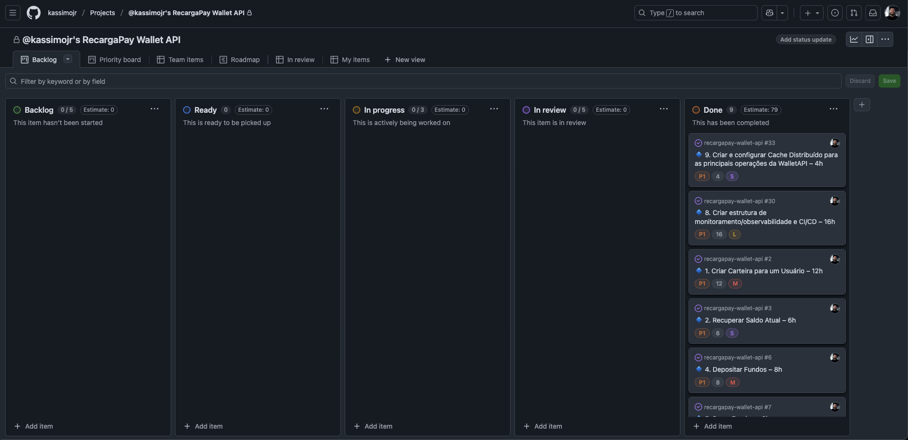

# 🚀 Digital Wallet API

## 📌 Visão Geral

O Digital Wallet API é um serviço robusto de carteira digital que permite gerenciar o saldo financeiro dos usuários, oferecendo operações essenciais como depósito, saque e transferência de fundos entre usuários. Desenvolvido com arquitetura hexagonal e as melhores práticas de engenharia de software, este serviço garante alta disponibilidade, rastreabilidade completa e segurança em todas as operações financeiras.

---

## 📑 Índice

- [🎯 Objetivos](#-objetivos)
- [🏗️ Arquitetura](#-arquitetura)
- [💻 Tecnologias](#-tecnologias)
- [🚀 Começando](#-começando)
- [🧪 Testes e Qualidade](#-testes-e-qualidade)
- [📝 Referência da API](#-referência-da-api)
- [🛠️ Operações e Monitoramento](#️-operações-e-monitoramento)
- [🔒 Segurança](#-segurança)
- [📚 Documentação Completa](#-documentação-completa)
- [🌍 Versões de Idioma](#-versões-de-idioma)

---

## 🎯 Objetivos

Este serviço de carteira digital foi desenvolvido para atender aos seguintes requisitos:

### Requisitos Funcionais

- **Criação de Carteira**: Permitir a criação de carteiras para usuários
- **Consulta de Saldo**: Recuperar o saldo atual da carteira de um usuário
- **Consulta de Saldo Histórico**: Recuperar o saldo da carteira de um usuário em um momento específico do passado
- **Depósito**: Permitir depósito de fundos na carteira
- **Saque**: Permitir saque de fundos da carteira
- **Transferência**: Facilitar a transferência de fundos entre carteiras de usuários

### Requisitos Não-Funcionais

- **Alta Disponibilidade**: Serviço crítico cuja indisponibilidade comprometeria a plataforma
- **Rastreabilidade**: Garantia de auditoria completa de todas as operações para verificação de saldos
- **Experiência de Uso**: Respostas detalhadas e informativas, incluindo nomes de usuários
- **Tratamento de Erros**: Implementação RFC 7807 para todos os erros conhecidos
- **Concorrência**: Transações isoladas para evitar condições de corrida

---

## 🏗️ Arquitetura

O projeto foi implementado seguindo os princípios da **Arquitetura Hexagonal** (ou Ports and Adapters), que permite um isolamento claro entre as regras de negócio e os detalhes de infraestrutura.

### Estrutura de Pacotes

```
com.digital.wallet/
├── adapter/                     # Adaptadores (Controllers, Repositories, DTOs)
│   ├── controllers/
│   │   └── v1/                  # Controladores REST v1
│   ├── converters/              # Conversores entre camadas (mappers)
│   ├── dtos/                    # Objetos de transferência de dados
│   ├── entities/                # Entidades JPA
│   └── repositories/
│       └── impl/                # Implementações de repositórios
├── core/                        # Núcleo de negócio
│   ├── domain/                  # Modelos de domínio
│   ├── exceptions/              # Exceções de negócio
│   ├── ports/                   # Portas (interfaces)
│   │   ├── in/                  # Portas de entrada (use cases)
│   │   └── out/                 # Portas de saída (repositories)
│   └── services/                # Implementações de casos de uso
│       └── common/              # Serviços comuns
└── infra/                       # Infraestrutura
    ├── config/                  # Configurações
    ├── handler/                 # Tratamento global de exceções
    ├── health/                  # Indicadores de saúde customizados
    ├── logging/                 # Logging estruturado
    ├── metrics/                 # Métricas e monitoramento
    └── tracing/                 # Rastreamento distribuído
```

### Diagrama de Componentes

```
┌─────────────────────────────────────────────────────────────┐
│                  Camada de API (Controllers)                 │
│              Endpoints REST + OpenAPI/Swagger                │
└───────────────────────────┬─────────────────────────────────┘
                            │
                            ▼
┌─────────────────────────────────────────────────────────────┐
│                    Camada de Aplicação                       │
│                 Services (Casos de Uso)                      │
│          Lógica de Negócio + Validação + Cache              │
└───────────────────────────┬─────────────────────────────────┘
                            │
                            ▼
┌─────────────────────────────────────────────────────────────┐
│                      Camada de Domínio                       │
│         Entidades + Regras de Negócio + Exceções            │
│              (User, Wallet, Transaction)                     │
└───────────────────────────┬─────────────────────────────────┘
                            │
                            ▼
┌─────────────────────────────────────────────────────────────┐
│                   Camada de Infraestrutura                   │
│    Banco + Cache + Segurança + Monitoramento + Logging      │
│    PostgreSQL + Redis + JWT + Grafana + Logs Estruturados   │
└───────────────────────────┬─────────────────────────────────┘
                            │
                            ▼
┌─────────────────────────────────────────────────────────────┐
│                   Stack de Observabilidade                  │
│     Prometheus + Grafana + Loki + Tempo + OpenTelemetry     │
│          Dashboards Tempo Real + Alertas + Tracing          │
└─────────────────────────────────────────────────────────────┘
```

### Recursos da Arquitetura

- **🔒 Segurança**: Autenticação JWT, CORS, headers de segurança
- **📊 Monitoramento**: Métricas Prometheus, health checks customizados
- **📝 Logging**: Logging JSON estruturado com rastreamento distribuído
- **⚡ Cache**: Cache distribuído Redis com estratégias de TTL
- **🔍 Observabilidade**: Integração OpenTelemetry para tracing
- **🛡️ Resiliência**: Tratamento global de exceções e validação

---

## 💻 Tecnologias

O projeto utiliza um stack moderno e robusto:

### Framework Principal
- **Java 21**: Linguagem principal com recursos avançados
- **Spring Boot 3.2+**: Framework para desenvolvimento da aplicação
- **Spring Data JPA**: Persistência de dados simplificada
- **Spring Security**: Autenticação e autorização
- **Spring Boot Actuator**: Recursos para produção e monitoramento

### Banco de Dados e Persistência
- **PostgreSQL**: Banco de dados de produção
- **H2 Database**: Banco de dados em memória para desenvolvimento e testes
- **Flyway**: Gerenciamento de migrações do banco de dados

### Cache e Performance
- **Redis**: Sistema de cache distribuído
- **Spring Cache**: Abstração de cache com integração Redis
- **Connection pooling**: Conexões otimizadas com banco de dados

### Stack de Observabilidade
- **Prometheus v2.45.6** - Versão LTS com estabilidade comprovada em produção
- **Grafana 11.2.0** - **Dashboards modernos** com UI aprimorada e inteligência de negócio
- **Loki 3.1.1** - Agregação estável de logs JSON estruturados com melhorias de performance
- **Promtail 3.1.1** - Envio aprimorado de logs com IDs de correlação e compatibilidade
- **Tempo 2.4.2** - Rastreamento distribuído estável com capacidades confiáveis
- **OpenTelemetry** - Framework unificado de observabilidade com integração completa do stack

### Segurança
- **JWT (JSON Web Tokens)**: Autenticação stateless
- **BCrypt**: Hash de senhas
- **Headers de Segurança**: CSRF, CORS e headers de segurança
- **Validação de Entrada**: Bean Validation (JSR-303)

### Documentação e API
- **Swagger/OpenAPI 3**: Documentação interativa da API
- **Spring REST Docs**: Documentação orientada por testes

### Desenvolvimento e Qualidade
- **Maven**: Gerenciamento de dependências e build
- **Docker & Docker Compose**: Containerização para desenvolvimento e produção
- **JUnit 5**: Framework de testes
- **Mockito**: Framework de mocking para testes unitários
- **JaCoCo**: Análise de cobertura de código
- **SonarQube**: Análise estática de código e quality gates
- **Preparado para ser integrado** em pipeline CI/CD

### DevOps e Deploy
- **Docker**: Containerização da aplicação
- **Docker Compose**: Orquestração multi-container
- **Perfis específicos por ambiente**: Configurações para dev, test, staging, produção

---

## 🚀 Começando

### Pré-requisitos

- JDK 21
- Maven 3.8+
- Docker e Docker Compose
- Git

### Clonando o Repositório

```bash
git clone https://github.com/seu-usuario/digital-wallet-api.git
cd digital-wallet-api
```

### 🎯 Validação Rápida (Recomendado)
**Simulação de Pipeline CI/CD** - Validação completa em um comando:

```bash
./wallet-api-startup.sh
```

Este script simula um pipeline CI/CD completo e valida:
- ✅ **Geração automática do `.env`** (baseado no template com valores padrão seguros)
- ✅ Configuração do ambiente e dependências
- ✅ Inicialização dos serviços de infraestrutura (Docker Compose)
- ✅ Build e testes da aplicação (Maven)
- ✅ Análise de qualidade de código (SonarQube)
- ✅ Deploy da aplicação e verificações de saúde
- ✅ **Validação da stack de monitoramento** (dashboards Grafana)

**🎯 Perfeito para**: Revisões de código, validação de integração, preparação de demos

### 🛠️ Modos de Desenvolvimento
Para necessidades específicas de desenvolvimento:

#### Configuração Manual da Infraestrutura
```bash
docker-compose up -d  # Apenas infraestrutura
mvn spring-boot:run   # Aplicação em modo desenvolvimento
```

#### Validação Passo a Passo
```bash
# 1. Serviços de infraestrutura
docker-compose up -d

# 2. Build e Testes
mvn clean verify

# 3. Qualidade de Código
mvn sonar:sonar

# 4. Aplicação
mvn spring-boot:run
```

Isso iniciará:
- Banco de dados PostgreSQL (porta 5432)
- Cache Redis (porta 6379)
- **Stack de observabilidade aprimorada** (Prometheus, Grafana, Loki, Tempo)
- Análise de código SonarQube (porta 9000)

### 🔧 Permissões de Scripts (Solução de Problemas)

Se você encontrar erros de permissão ao executar scripts, corrija todas as permissões:

```bash
# Corrigir permissões de todos os scripts .sh de uma vez
find . -name "*.sh" -type f -exec chmod +x {} \;
```

**Dica Pro:** Adicione este alias ao seu perfil do shell:
```bash
alias fix-scripts="find . -name '*.sh' -type f -exec chmod +x {} \;"
```

```bash
docker-compose ps
```

Você verá uma lista dos serviços em execução e suas portas.

### Configuração de Ambiente

Copie o template de ambiente e configure suas variáveis:

```bash
cp src/main/resources/templates/.env.template .env
# Edite o .env com suas configurações específicas
```

Principais variáveis de ambiente:
- `DB_HOST`, `DB_PORT`, `DB_NAME`: Conexão com banco de dados
- `JWT_SECRET`: Segredo para assinatura JWT (mínimo 256 bits)
- `REDIS_HOST`, `REDIS_PORT`: Conexão com cache Redis
- `ADMIN_USERNAME`, `ADMIN_PASSWORD`: Usuário admin padrão

Para configuração detalhada do ambiente, veja: [Configuração de Ambiente](configuration/pt/README.md)

---

## 🧪 Testes e Qualidade

### Executando Testes

```bash
# Testes unitários
mvn test

# Testes de integração
mvn verify

# Todos os testes com cobertura
mvn clean test jacoco:report
```

O relatório de cobertura estará disponível em `target/site/jacoco/index.html`

### Qualidade de Código

O projeto mantém altos padrões de qualidade:


*Análise do SonarQube mostrando 90%+ de cobertura de testes e métricas de qualidade*

- **90%+ de cobertura de testes** obrigatória
- **Quality gates do SonarQube** para análise de código
- **Preparado para ser integrado** em pipeline CI/CD

### Testando a API

Você pode usar qualquer uma destas ferramentas para testar a API:

- **Swagger UI**: `http://localhost:8080/swagger-ui.html`
- **Postman**: Importe a collection de `docs/api/postman-collection.json`
- **cURL**: Exemplos na documentação da API

---

## 📝 Referência da API

### Autenticação

Todos os endpoints requerem autenticação JWT exceto o endpoint de login.

```bash
# Login para obter token JWT
curl -X POST http://localhost:8080/api/v1/auth/login \
  -H "Content-Type: application/json" \
  -d '{"username": "admin", "password": "admin"}'
```

### Endpoints Principais

| Método | Endpoint | Descrição |
|--------|----------|-----------|
| `POST` | `/api/wallets` | Criar nova carteira |
| `GET` | `/api/wallets/{userId}/balance` | Obter saldo atual |
| `GET` | `/api/wallets/{userId}/balance?date={date}` | Obter saldo histórico |
| `POST` | `/api/wallets/{userId}/deposit` | Depositar fundos |
| `POST` | `/api/wallets/{userId}/withdraw` | Sacar fundos |
| `POST` | `/api/wallets/transfer` | Transferir entre carteiras |

### 📋 Recursos para Teste da API
- **Swagger UI**: `http://localhost:8080/swagger-ui.html`
- **Collection Postman**: [Importar de docs/collections/postman/](docs/collections/postman/)

### 🔧 Exemplos cURL

#### 1. Criar Carteira
```bash
curl -X POST http://localhost:8080/api/wallets \
  -H "Authorization: Bearer $JWT_TOKEN" \
  -H "Content-Type: application/json" \
  -d '{
    "userId": "123e4567-e89b-12d3-a456-426614174000",
    "userName": "João Silva",
    "initialBalance": 100.00
  }'
```

#### 2. Obter Saldo Atual
```bash
curl -X GET http://localhost:8080/api/wallets/123e4567-e89b-12d3-a456-426614174000/balance \
  -H "Authorization: Bearer $JWT_TOKEN"
```

#### 3. Obter Saldo Histórico
```bash
curl -X GET "http://localhost:8080/api/wallets/123e4567-e89b-12d3-a456-426614174000/balance?date=2025-01-15T10:30:00Z" \
  -H "Authorization: Bearer $JWT_TOKEN"
```

#### 4. Depositar Fundos
```bash
curl -X POST http://localhost:8080/api/wallets/123e4567-e89b-12d3-a456-426614174000/deposit \
  -H "Authorization: Bearer $JWT_TOKEN" \
  -H "Content-Type: application/json" \
  -d '{
    "amount": 50.00,
    "description": "Depósito de salário"
  }'
```

#### 5. Sacar Fundos
```bash
curl -X POST http://localhost:8080/api/wallets/123e4567-e89b-12d3-a456-426614174000/withdraw \
  -H "Authorization: Bearer $JWT_TOKEN" \
  -H "Content-Type: application/json" \
  -d '{
    "amount": 25.00,
    "description": "Saque no caixa eletrônico"
  }'
```

#### 6. Transferir Entre Carteiras
```bash
curl -X POST http://localhost:8080/api/wallets/transfer \
  -H "Authorization: Bearer $JWT_TOKEN" \
  -H "Content-Type: application/json" \
  -d '{
    "fromUserId": "123e4567-e89b-12d3-a456-426614174000",
    "toUserId": "987fcdeb-51d2-43a8-b456-426614174999",
    "amount": 30.00,
    "description": "Pagamento para amigo"
  }'
```

> **💡 Nota**: Substitua `$JWT_TOKEN` pelo token real obtido do endpoint de login

---

## 🛠️ Operações e Monitoramento

### Health Checks

A aplicação fornece health checks abrangentes:

```bash
# Saúde da aplicação
curl http://localhost:8080/actuator/health

# Saúde detalhada com componentes
curl http://localhost:8080/actuator/health/detailed
```

### 📊 Dashboards Tempo Real
Acesse monitoramento abrangente em `http://localhost:3000` (admin/admin):

#### 🚦 Dashboard de Saúde da Aplicação

*Status do sistema em tempo real, métricas de performance e alertas*

#### 💰 Dashboard de Métricas de Negócio

*Taxas de transação, saldos de carteiras e KPIs financeiros*

### 🔍 Stack de Observabilidade
- **Prometheus** (`localhost:9090`) - Coleta de métricas e alertas
- **Grafana** (`localhost:3000`) - Visualização e dashboards  
- **Loki** (`localhost:3100`) - Logging centralizado
- **Tempo** (`localhost:3200`) - Rastreamento distribuído

### 📈 Principais Métricas Monitoradas
- **Saúde do Sistema**: Status da API, conectividade do banco, performance do cache
- **Métricas de Negócio**: Taxas de transação, saldos de carteiras, taxas de sucesso das operações
- **Performance**: Tempos de resposta, throughput, utilização de recursos
- **Alertas**: Notificações automáticas para problemas críticos

> **💡 Dica**: Execute `./wallet-api-startup.sh` para validar automaticamente toda a stack de monitoramento

### Gerenciamento de Logs

Os logs são estruturados em formato JSON para melhor observabilidade:


*Rastreamento distribuído e logging estruturado com IDs de correlação no Grafana/Loki*

- **Desenvolvimento local**: Saída no console
- **Deploy em container**: Disponível via `docker logs digital-wallet-api`
- **Produção**: Agregados no stack Loki/Grafana

Exemplo de entrada de log:
```json
{
  "timestamp": "2025-01-15T10:30:45.123Z",
  "level": "INFO",
  "traceId": "b4ae80e90152b7ab443b5db11e0914b9",
  "spanId": "7f2c1a8b9e3d4c5f",
  "logger": "com.digital.wallet.application.service.DepositService",
  "message": "Operação de depósito concluída com sucesso",
  "operation": "DEPOSIT",
  "walletId": "123e4567-e89b-12d3-a456-426614174000",
  "amount": 100.00
}
```

Para configuração detalhada de monitoramento, veja: [Documentação de Observabilidade](monitoring/pt/README.md)

---

## 🔒 Segurança

A aplicação implementa medidas de segurança abrangentes:

### Autenticação e Autorização
- **Autenticação baseada em JWT** com expiração configurável
- **Controle de acesso baseado em roles** (RBAC)
- **Hash seguro de senhas** com BCrypt

### Segurança da API
- **Validação de entrada** em todos os endpoints
- **Prevenção de SQL injection** via JPA/Hibernate
- **Configuração CORS** para requisições cross-origin
- **Rate limiting** para prevenir abuso

### Headers de Segurança
- **Proteção CSRF** para operações que alteram estado
- **Headers de segurança** (X-Frame-Options, X-Content-Type-Options, etc.)
- **Enforcement HTTPS** em ambientes de produção

### Proteção de Dados
- **Mascaramento de dados sensíveis** nos logs
- **Gerenciamento de segredos** baseado em ambiente
- **Criptografia de banco** para campos sensíveis

Para configuração detalhada de segurança, veja: [Documentação de Segurança](security/pt/README.md)

---

## 📚 Documentação Completa

### 🗂️ Categorias de Documentação

Toda a documentação do projeto está organizada por categorias, disponível em português e inglês:

| 📂 Categoria | 🇺🇸 English | 🇧🇷 Português | 📋 Descrição |
|-------------|-------------|---------------|-------------|
| **⚙️ Configuration** | [Setup Guide](configuration/en/README.md) | [Guia de Configuração](configuration/pt/README.md) | Configuração de ambiente, variáveis, perfis |
| **🚀 Onboarding** | [Team Guide](onboarding/en/README.md) | [Guia do Time](onboarding/pt/README.md) | Integração de desenvolvedores, setup inicial |
| **💾 Caching** | [Redis Setup](caching/en/README.md) | [Configuração Redis](caching/pt/README.md) | Cache distribuído, TTLs, performance |
| **🔒 Security** | [Security Config](security/en/README.md) | [Configuração Segurança](security/pt/README.md) | JWT, autenticação, headers de segurança |
| **📊 Monitoring** | [Observability](monitoring/en/README.md) | [Observabilidade](monitoring/pt/README.md) | Métricas, dashboards, alertas |
| **🔍 Tracing** | [Distributed Tracing](tracing/en/README.md) | [Rastreamento](tracing/pt/README.md) | Logs estruturados, correlação, debugging |

### 🚀 Quick Start por Função

#### 👨‍💻 Novo no projeto?
1. **[Guia de Integração do Time](onboarding/pt/README.md)** - Checklist completo de integração
2. **[Configuração de Desenvolvimento Local](configuration/pt/README.md)** - Configuração do ambiente local
3. **[Configuração de Segurança](security/pt/README.md)** - Setup de segurança e JWT

#### ⚙️ Configurar ambiente?
1. **[Configuração de Ambiente](configuration/pt/README.md)** - Guia completo de configuração
2. **[Configuração do Redis Cache](caching/pt/README.md)** - Cache distribuído
3. **[Setup de Observabilidade](monitoring/pt/README.md)** - Monitoramento e métricas

#### 🐳 Setup Docker?
1. **[Desenvolvimento Local](configuration/pt/README.md)** - Setup com Docker
2. **[Configuração de Ambiente](configuration/pt/README.md)** - Deploy com containers

#### 🔧 Problemas?
1. **[Problemas Comuns](configuration/pt/README.md)** - Soluções para problemas comuns
2. **[Problemas de Segurança](security/pt/README.md)** - Problemas de segurança
3. **[Problemas de Cache](caching/pt/README.md)** - Problemas de cache

### 📖 Documentação por Público

#### Para Desenvolvedores
- **[Integração do Time](onboarding/pt/README.md)** - Integração completa ao projeto
- **[Setup Local](configuration/pt/README.md)** - Ambiente de desenvolvimento
- **[Testes da API](configuration/pt/README.md)** - Coleções Postman/Insomnia
- **[Implementação de Cache](caching/pt/README.md)** - Como usar o cache
- **[Automação SonarQube](configuration/pt/sonarqube-automation.md)** - Automação de qualidade de código

#### Para DevOps/SysAdmin
- **[Configuração de Ambiente](configuration/pt/README.md)** - Configuração completa
- **[Configuração de Segurança](security/pt/README.md)** - Segurança e compliance
- **[Setup de Monitoramento](monitoring/pt/README.md)** - Observabilidade e alertas
- **[Deploy em Produção](configuration/pt/README.md)** - Deploy em produção
- **[Configuração de Senhas SonarQube](configuration/pt/sonarqube-password-config.md)** - Gerenciamento de senhas SonarQube
- **[Versões Docker](configuration/pt/docker-versions.md)** - Referência de versões das imagens Docker

#### Para Arquitetos/Tech Leads
- **[Visão Geral da Arquitetura](#arquitetura)** - Visão geral da arquitetura hexagonal
- **[Rastreamento Distribuído](tracing/pt/README.md)** - Rastreamento e correlação
- **[Otimização de Performance](caching/pt/README.md#benefícios-de-performance)** - Otimizações de performance
- **[Arquitetura de Segurança](security/pt/README.md)** - Arquitetura de segurança

---

## 🎯 Planejamento e Entrega do Projeto sob Restrições de Tempo

Este projeto foi planejado, refinado e guiado de forma estruturada e organizada utilizando **metodologia Kanban**.


*Planejamento e acompanhamento da execução do projeto usando metodologia Kanban*

**🔗 Board Kanban**: [Ver Board do Projeto](https://github.com/users/kassimojr/projects/1/views/1)

O projeto foi desenvolvido com foco em qualidade e apesar de ser para um Assessment, cada etapa foi cuidadosamente planejada e executada.

Abaixo segue uma estimativa realista de tempo estimado via **refinamento técnico vs tempo gasto**:

### Comparativo de Tempo por Atividade

| Atividade | Estimado | Realizado | Economia | Eficiência |
|-----------|----------|-----------|----------|------------|
| Cache Distribuído | 4h | 2h | 2h | 50% |
| Monitoramento/Observabilidade e CI/CD | 16h | 8h | 8h | 50% |
| Criar Carteira para Usuário | 12h | 6h | 6h | 50% |
| Recuperar Saldo Atual | 6h | 3h | 3h | 50% |
| Depositar Fundos | 8h | 4h | 4h | 50% |
| Sacar Fundos | 8h | 4h | 4h | 50% |
| Transferir Fundos | 10h | 5h | 5h | 50% |
| Testes/Postman/Swagger/README | 8h | 3h | 5h | 38% |
| Recuperar Saldo Histórico | 7h | 3.5h | 3.5h | 50% |
| TOTAL | 79h | 38.5h | 40.5h | 49% |

### Resumo Executivo

| Métrica | Valor |
|---------|-------|
| Total Estimado | 79h |
| Total Realizado | 38.5h |
| Economia Total | 40.5h |
| Eficiência Geral | 49% |

### Análise por Categoria

| Categoria | Estimado | Realizado | Economia | Eficiência |
|-----------|----------|-----------|----------|------------|
| Infraestrutura/DevOps | 16h | 8h | 8h | 50% |
| Desenvolvimento APIs Core | 51h | 25.5h | 25.5h | 50% |
| Testes e Documentação | 8h | 3h | 5h | 38% |
| Cache/Performance | 4h | 2h | 2h | 50% |

### 🎯 Principais Insights de Desenvolvimento

**🚀 Aceleração Significativa**
- Redução de aproximadamente 49% no tempo de desenvolvimento
- Manutenção da qualidade técnica com 90%+ de cobertura de testes
- Entrega de funcionalidades além do escopo original

**💡 Áreas de Maior Impacto**
- **Documentação Técnica**: Geração completa de documentação bilíngue
- **Configuração de Infraestrutura**: Setup automatizado de observabilidade
- **Geração de Código**: Aceleração na criação de controllers, services e testes
- **Resolução de Problemas**: Identificação e resolução rápida de questões técnicas

**🔧 Abordagem Técnica**
O processo de desenvolvimento focou em decisões arquiteturais estratégicas e validação de regras de negócio, aproveitando **vibe coding** para acelerar tarefas de implementação operacionais. Todos os componentes foram devidamente revisados e testados, garantindo a qualidade e robustez da solução final.

**📊 Resultado**: Entrega de um projeto completo e robusto em 38.5 horas, representando aproximadamente 2x de eficiência de desenvolvimento em relação à estimativa original.

---

## 🌍 Versões de Idioma

- **🇧🇷 Português**: Você está aqui!
- **🇺🇸 English**: [English README](../README.md)

---

## 📝 Contato

linkedin: https://www.linkedin.com/in/kassimojr/

---
**Construído com ❤️ por Kássimo Júnior**
